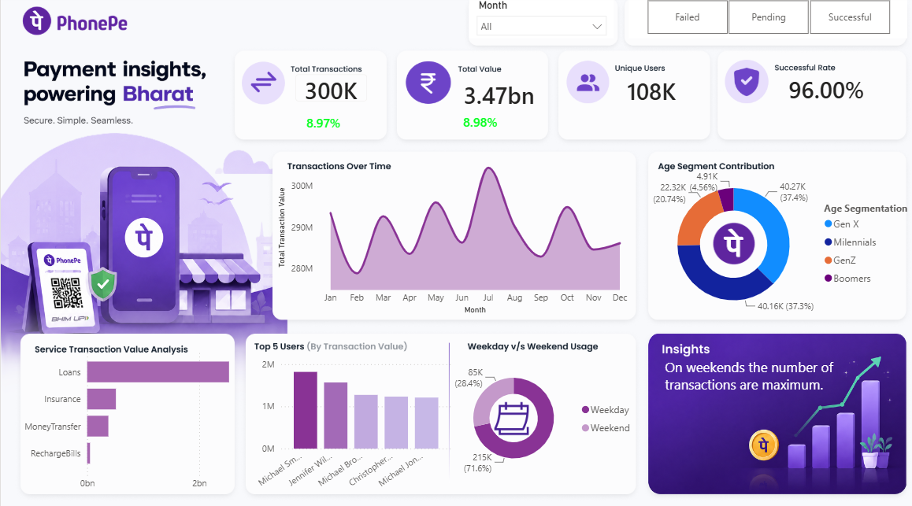

# 📱 PhonePe Transaction & User Analysis Dashboard

## 📌 Project Overview

This project analyzes PhonePe transaction and user data to understand transaction performance, user behavior, payment outcomes, and service-level trends.

The raw data was cleaned and prepared in **Microsoft Excel** and analyzed using **Power BI** to create an interactive business intelligence dashboard.

---

## 🎯 Project Objectives

- Analyze overall transaction performance
- Track transaction trends over time
- Compare successful and failed transactions
- Understand user demographics and behavior
- Analyze service-wise transaction performance
- Identify major transaction failure reasons
- Generate business insights from transactional data

---

## 🛠️ Tools & Technologies

- **Microsoft Excel** – Data cleaning and preparation
- **Power BI** – Data modeling, visualization, and dashboard development
- **DAX** – Calculated measures and KPI development

---

## 📊 Dashboard Preview

### PhonePe Transaction & User Analysis Dashboard

**Click the image to view the dashboard screenshot in full size.**

---

## 🔍 Key Analysis

The dashboard provides insights into:

- Total transaction amount
- Total number of transactions
- Successful vs. failed transactions
- Transaction trends over time
- Service-wise performance
- Service-type analysis
- User demographics
- Transaction failure reasons
- Payment performance

---

## 💡 Key Insights

The analysis helps identify:

- Overall transaction and payment performance
- Trends in transaction activity over time
- Services generating higher transaction activity
- Differences between successful and failed transactions
- Major reasons behind transaction failures
- User demographic patterns

---

## 📈 Skills Demonstrated

- Data Cleaning & Preparation
- Data Analysis
- Data Modeling
- DAX
- KPI Development
- Data Visualization
- Interactive Dashboard Design
- Business Intelligence
- Business Insight Generation
- Microsoft Excel
- Power BI

---

## 📂 Project Files

| File | Description |
|---|---|
| `Phonepe-Final-Dataset.xlsx` | Dataset used for the analysis |
| `PhonepeBI.pbix` | Power BI dashboard and data model |
| `Screenshot.png` | Dashboard preview |
| `DAX.md` | DAX measures used in the project |
| `PhonePelogo.png` | Project branding/logo |

---

## 🚀 How to Use

1. Download `PhonepeBI.pbix`.
2. Open the file using **Power BI Desktop**.
3. If required, update the dataset file path.
4. Refresh the data.
5. Explore the dashboard using the available filters and visuals.

---

## 👤 Project Type

**Entry-Level Data Analyst Portfolio Project**

This project demonstrates practical skills in **Excel, Power BI, DAX, data analysis, data visualization, and business intelligence**.
